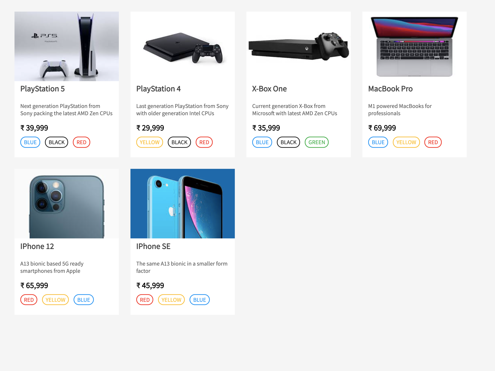

# Create an E-Commerce product search page clone (Part 1): List

## Problem Statement

Given a list of products create a basic HTML page that can render the products as a list of cards. Iterate over the given list to render the item card inside of a parent component identified by `id=”root”`.

Some basic CSS classes & JavaScript function declarations are provided as a starting point for this assignment. You would have to implement the following functions:

```
createProductCard
renderAllCards
```


## Implementation guidelines:

Try to start with the renderAllCards function and inside of it first find the element with `id=”root”` using `document.querySelector`.

The `renderAllCards` function should take the list of items as an argument 

(**NOTE**: referring to the global variable inside this function might cause your submission to fail).

Once you’ve selected the root element and the list of items as a parameter, now it’s time to iterate through the list to create the individual cards. 

Call the `createProductCard` function to get back a DOM element which can be appended to the root element as a child.

The createProductCard function will accept a parameter of type object with the following structure:

```javascript
{
  "id": 1,
  "name": "PlayStation 5",
  "description": "....",
  "image": "....",
  "price": 400,
  "memory": "8 GB",
  "storage": "1 TB",
  "colors": ['black', 'white', 'blue']
}
```

You’re expected to return a DOM element i.e. the card component for the given payload.

- The card component should be a `div` element having `class=‘product’` and a data attribute called `data-item-id` containing the id of that product item.

The card component should have the following:

- An IMG element with src attribute containing the image URL and class name as `‘product__image’`

- One `H3` element with class `‘product__name’` containing the product name

- One P tag containing the product description with class `‘product__description’`

- One H4 tag containing the price with class `‘product__price’`

Use span tags for other product tags like memory, storage, colors (each). Given as a reference implementation.


## Data Source
A global variable called `window.productList`

```javascript
window.productList = [
  {
    id: 1,
    name: 'Playstation 5',
    image: '....',
    description: 'Next gen Console gaming',
    price: '400',
    memory: '8 GB',
    storage: '1 TB',
    color: ['black', 'white', 'blue'],
  },
  {
    id: 1,
    name: 'Playstation 4',
    image: '....',
    description: 'Previous gen Console gaming',
    price: '200',
    memory: '4 GB',
    storage: '1 TB',
    color: ['red', 'white', 'blue'],
  },
  {
    id: 1,
    name: 'iPhone 12',
    image: '....',
    description: 'Smartphone',
    price: '650',
    memory: '4 GB',
    storage: '256 GB',
    color: ['black', 'white', 'blue', 'red'],
  },
  ....
]
```

## Expected Output
Your submission should look like the following


